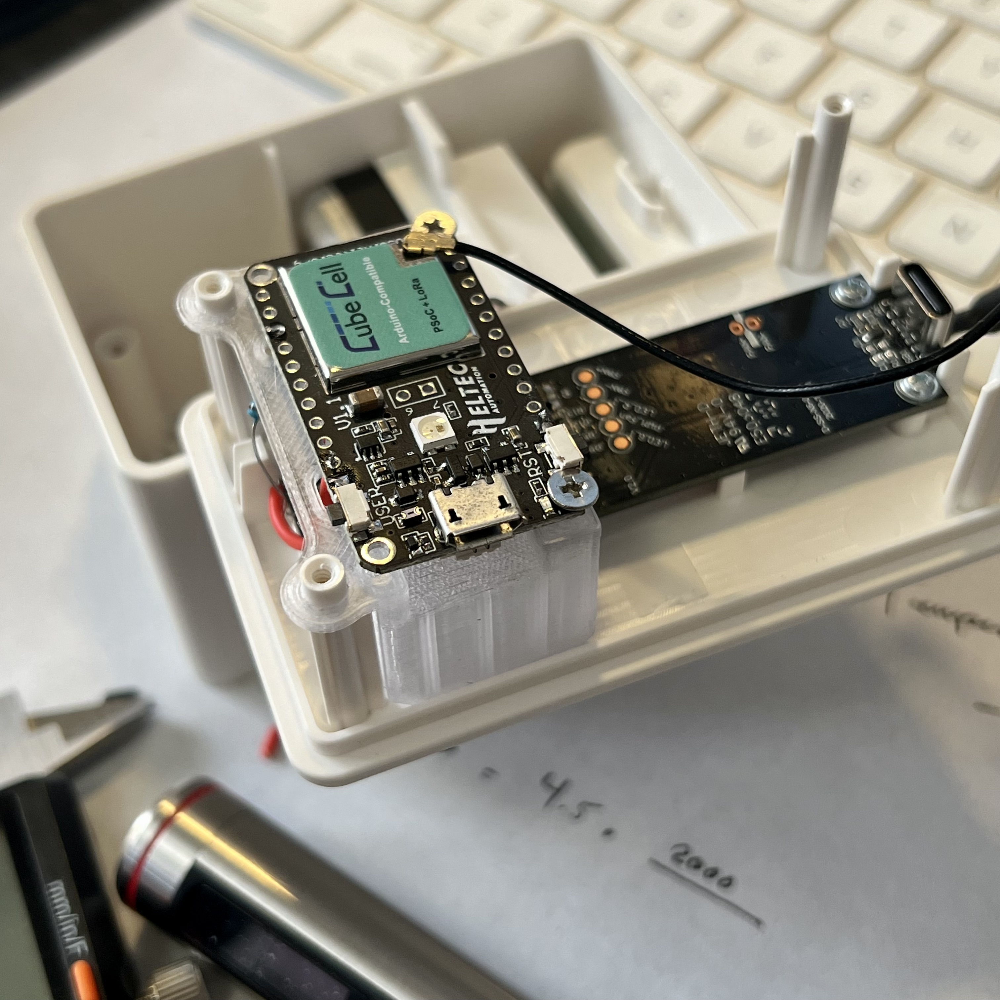

# Helium LoRaWAN connectivity for the Ikea VINDRIKTNING

This repository contains an Heltec Cubecell firmware, which adds Helium LoRaWAN connectivity to the Ikea VINDRIKTNING PM2.5 air quality sensor.
The modification doesn't interfere with normal operation of the IKEA device in any way.
The Cubecell just adds another data sink beside the colored LEDs.

The Cubecell seems to be 5V-tolerant, but just in case I have been wiring in the data lines with use of a voltage divider.
## Prerequisites
To extend your air quality sensor, you will need

- A LoRaWAN-enabled dev board, in this case the [Heltec Cubecell HTCC-AB01](https://heltec.org/project/htcc-ab01/) ([US Domestic](https://shop.parleylabs.com/collections/iot-developers-products/products/cubecell-dev-board-by-heltec-htcc-ab01))
- Some short dupont cables
- A soldering iron
- A long PH0 Screwdriver (e.g. Wera 118022)

Fortunately, there is a lot of unused space in the enclosure, which fits the HTCC-AB01 well.
Also, everything we need is accessible via easy to solder testpoints.
## Hardware
To install, just unscrew the four visible screws in the back of the enclosure.

There are also three screws holding the IKEA PCB in place. These aren't necessary to remove since you can solder in-place, however personally, I'd recommend taking the board out of there since it will be easier to solder without fear of accidentally melting some plastic.

As you can see in this image, you'll need to solder wires to GND, 5V and the Testpoint that is connected to TX of the Particle Sensor.

Then just connect these Wires to GND, VIN (5V) and Pin 2 on the Cubecell

Done.
## Software
The firmware can be built and flashed using the PlatformIO IDE. PRs welcome for any Arduino IDE support/testing.

LoRaWAN network keys will need to be added in the code. All keys are MSB.
After keys are added; just build, flash, and you're done.
## Misc
The VINDRIKTNING consists of a custom(?) Cubic PM1006-like Sensor + another uC that does all that LED stuff, which talk via UART. 
Therefore, to add LoRaWAN connectivity, we just need to also listen to the TX of the Sensor and decode those messages.
The transitions from Green to Yellow and Yellow to Red in the Ikea firmware are at around 30μg/m³ and 100μg/m³.
## ToDo
- [ ] Downlink config
- [ ] Docs
## References and sources
- [Source Repo](https://github.com/Hypfer/esp8266-vindriktning-particle-sensor)
- [@haxfleisch](https://twitter.com/haxfleisch) for their teardown of the device.
- [Gabriel Valky](https://github.com/gabonator) for the incredibly useful [LA104 custom firmware + tools](https://github.com/gabonator/LA104)
